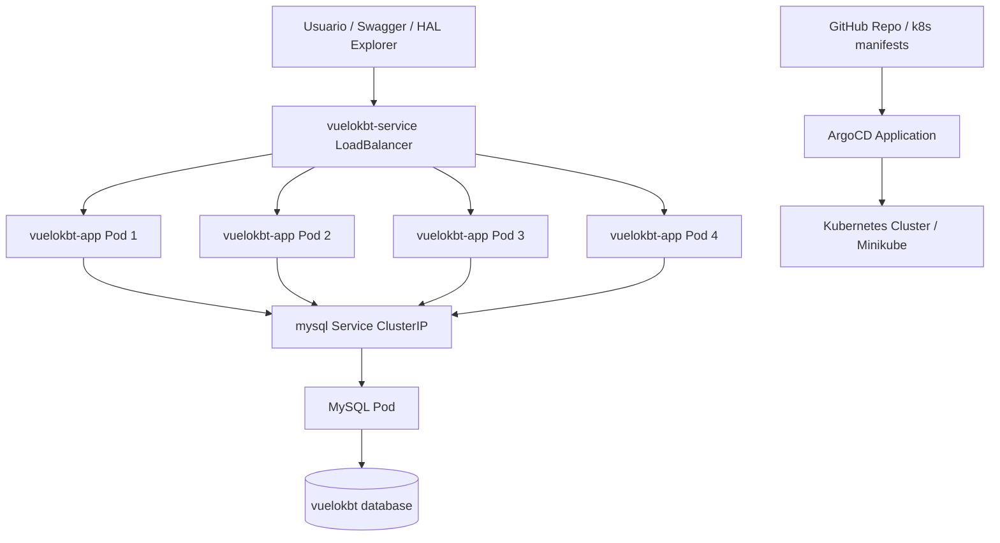

# Laboratorio 3 - Prueba de Servicios REST con HATEOAS, Docker, MySQL y Kubernetes

<div align="center">

**Arquitectura de Software - Universidad de Antioquia**

**Proyecto:** `vuelokbt`  
**Profesor:** Diego Jose Luis Botia V

**Integrantes**  
Santiago Palacio Cardenas  
Sarai Restrepo Rodriguez  
Juan Pablo Herrera Jaramillo  
Jimena Munoz Gomez

API RESTful para gestion de vuelos con Spring Boot, persistencia en MySQL, contenerizacion con Docker, despliegue en Kubernetes/Minikube y sincronizacion GitOps con ArgoCD.

</div>

## Badges e Iconos


[](https://skillicons.dev)

## Descripcion del Proyecto

Este repositorio corresponde al **Laboratorio 3 de Arquitectura de Software** de la **Universidad de Antioquia**. El proyecto implementa una **API RESTful de gestion de vuelos** construida con **Spring Boot 2.7.17** y **Java 11**, persistida en **MySQL**, empaquetada con **Maven** y preparada para ejecucion local, contenerizacion con **Docker**, despliegue en **Kubernetes/Minikube** y sincronizacion **GitOps** con **ArgoCD**.

La aplicacion permite:

- Crear vuelos.
- Listar todos los vuelos.
- Consultar un vuelo por ID.
- Consultar los mejores vuelos segun rating.
- Actualizar vuelos.
- Eliminar vuelos.
- Persistir informacion en MySQL.
- Exponer documentacion con Swagger/OpenAPI.
- Incluir dependencias de soporte para HATEOAS y HAL Explorer.
- Ejecutarse localmente por defecto en el puerto `8089`.
- Construirse como imagen Docker a partir del JAR generado por Maven.
- Desplegarse en Kubernetes usando manifiestos YAML simples.
- Gestionarse con ArgoCD desde el repositorio GitHub del laboratorio.
- Escalar horizontalmente aumentando las replicas del Deployment de la aplicacion.

## Tabla de Contenido

- [Descripcion del Proyecto](#descripcion-del-proyecto)
- [Objetivos del Laboratorio](#objetivos-del-laboratorio)
- [Arquitectura de la Solucion](#arquitectura-de-la-solucion)
- [Stack Tecnologico](#stack-tecnologico)
- [Estructura del Proyecto](#estructura-del-proyecto)
- [Modelo de Datos](#modelo-de-datos)
- [Endpoints Disponibles](#endpoints-disponibles)
- [Configuracion y Variables Relevantes](#configuracion-y-variables-relevantes)
- [Ejecucion Local](#ejecucion-local)
- [Documentacion API: Swagger y HAL Explorer](#documentacion-api-swagger-y-hal-explorer)
- [Contenerizacion con Docker](#contenerizacion-con-docker)
- [Despliegue en Kubernetes con Minikube](#despliegue-en-kubernetes-con-minikube)
- [GitOps con ArgoCD](#gitops-con-argocd)
- [Escalabilidad Horizontal](#escalabilidad-horizontal)
- [Monitoreo Ligero con Grafana](#monitoreo-ligero-con-grafana)
- [Pruebas Funcionales Sugeridas](#pruebas-funcionales-sugeridas)
- [Estado Actual del Repositorio](#estado-actual-del-repositorio)
- [Sugerencia para Evidencias y Capturas](#sugerencia-para-evidencias-y-capturas)
- [Repositorio](#repositorio)

## Objetivos del Laboratorio

- Desarrollar una aplicacion RESTful con Spring Boot para la gestion de vuelos.
- Implementar principios de integracion REST y soporte de dependencias HATEOAS/HAL.
- Integrar MySQL como motor de persistencia.
- Contenerizar la aplicacion mediante Docker.
- Desplegar la aplicacion y la base de datos en Kubernetes.
- Validar el comportamiento de la API con Swagger/OpenAPI.
- Verificar la persistencia de los datos en MySQL.
- Implementar una estrategia GitOps usando ArgoCD.
- Experimentar con escalabilidad horizontal aumentando replicas.
- Realizar una prueba basica de carga y observar el comportamiento del sistema.

## Arquitectura de la Solucion

La solucion sigue una arquitectura por capas clasica para aplicaciones Spring Boot:

- **Controller:** expone los endpoints REST bajo la ruta base `/flight`.
- **Service:** centraliza la logica de negocio para guardar, listar, actualizar y eliminar vuelos.
- **DAO/Repository:** usa Spring Data JPA para el acceso a datos y una consulta JPQL para obtener vuelos destacados.
- **Model/Entity:** define la entidad `Flight`, que representa la informacion persistida en la tabla de vuelos.
- **MySQL:** actua como base de datos relacional.
- **Docker:** empaqueta la aplicacion en una imagen liviana basada en Java 11.
- **Kubernetes:** orquesta la aplicacion y la base de datos mediante Deployments y Services.
- **ArgoCD:** sincroniza automaticamente los manifiestos de la carpeta `k8s/` desde GitHub.

### Diagrama de Arquitectura



## Stack Tecnologico

| Capa | Tecnologia | Version / Estado |
| --- | --- | --- |
| Lenguaje | Java | 11 |
| Framework | Spring Boot | 2.7.17 |
| Build Tool | Maven Wrapper | `mvnw` / `mvnw.cmd` |
| Persistencia | Spring Data JPA | Incluida |
| Base de datos | MySQL | `mysql:5.7` en Kubernetes |
| API Docs | Springdoc OpenAPI UI | 1.7.0 |
| HATEOAS | Spring HATEOAS + HAL Explorer | Dependencias presentes |
| Empaquetado | Docker | `eclipse-temurin:11-jre` |
| Orquestacion | Kubernetes | Manifiestos YAML |
| Cluster local | Minikube | Uso previsto |
| GitOps | ArgoCD | `Application` declarada |
| Monitoreo opcional | Grafana | Manifiesto ligero disponible |

## Estructura del Proyecto

```text
lab3-20261/
├── argocd/
│   └── application.yml
├── k8s/
│   ├── app-deployment.yml
│   ├── mysql-configmap.yml
│   └── mysql-deployment.yml
├── monitoring/
│   └── grafana-simple.yml
├── src/
│   ├── main/
│   │   ├── java/com/udea/vuelokbt/
│   │   │   ├── controller/
│   │   │   ├── dao/
│   │   │   ├── exception/
│   │   │   ├── model/
│   │   │   ├── service/
│   │   │   ├── OpenApiConfig.java
│   │   │   └── VuelokbtApplication.java
│   │   └── resources/
│   │       └── application.properties
│   └── test/
│       └── java/com/udea/vuelokbt/
├── Dockerfile
├── pom.xml
└── README.md
```

### Paquetes Principales

| Paquete / Archivo | Responsabilidad |
| --- | --- |
| `controller/FlightController.java` | Expone los endpoints REST de la aplicacion |
| `service/FlightService.java` | Implementa la logica de negocio |
| `dao/IFlightDAO.java` | Acceso a datos con `CrudRepository` y JPQL |
| `model/Flight.java` | Entidad JPA para la tabla `flight` |
| `exception/*` | Excepciones de dominio y errores de recurso no encontrado |
| `OpenApiConfig.java` | Configuracion basica de OpenAPI |
| `VuelokbtApplication.java` | Clase principal de arranque |

## Modelo de Datos

La entidad principal del proyecto es `Flight`, persistida en la tabla `flight`.

| Campo | Tipo en Java | Descripcion |
| --- | --- | --- |
| `idFlight` | `Long` | Identificador del vuelo |
| `nombreAvion` | `String` | Nombre del avion |
| `numeroVuelo` | `String` | Numero o codigo de vuelo |
| `origen` | `String` | Ciudad o punto de origen |
| `destino` | `String` | Ciudad o punto de destino |
| `capacidad` | `int` | Capacidad del avion |
| `rating` | `int` | Calificacion del vuelo |
| `planvuelo` | `long` | Valor numerico asociado al plan de vuelo |
| `cumplido` | `Boolean` | Indica si el vuelo fue cumplido |

### Ejemplo JSON para crear un vuelo

```json
{
	"nombreAvion": "Airbus A320",
	"numeroVuelo": "AV123",
	"origen": "Medellin",
	"destino": "Bogota",
	"capacidad": 180,
	"rating": 5,
	"planvuelo": 202605220830,
	"cumplido": true
}
```

## Endpoints Disponibles

La ruta base actual del controlador es `http://localhost:8089/flight`.

| Metodo | Endpoint | Descripcion | Implementacion actual |
| --- | --- | --- | --- |
| `POST` | `/flight/save` | Crea un vuelo | Retorna el `idFlight` generado |
| `GET` | `/flight/listAll` | Lista todos los vuelos | Retorna `Iterable<Flight>` |
| `GET` | `/flight/list/{id}` | Consulta un vuelo por ID | Retorna `Flight` o `404` |
| `GET` | `/flight/topFlights` | Consulta vuelos con `rating >= 4` y `cumplido = true` | Retorna lista desde JPQL |
| `PUT` | `/flight` | Actualiza un vuelo existente | Retorna el vuelo actualizado |
| `DELETE` | `/flight/{id}` | Elimina un vuelo por ID | Retorna mensaje `Flight deleted` |

### Consulta JPQL de vuelos destacados

El repositorio usa la siguiente consulta para obtener mejores vuelos:

```java
@Query("from Flight f where f.rating>=4 AND f.cumplido=true")
public List<Flight> viewBestFlight();
```

## Configuracion y Variables Relevantes

### Configuracion base en `application.properties`

| Propiedad | Valor actual |
| --- | --- |
| `spring.application.name` | `vuelokbt` |
| `server.port` | `${SERVER_PORT:8089}` |
| `spring.datasource.url` | `${SPRING_DATASOURCE_URL:jdbc:mysql://localhost:3306/vuelokbt?useSSL=false&allowPublicKeyRetrieval=true&serverTimezone=UTC}` |
| `spring.datasource.username` | `${SPRING_DATASOURCE_USERNAME:root}` |
| `spring.datasource.password` | `${SPRING_DATASOURCE_PASSWORD:root}` |
| `spring.jpa.hibernate.ddl-auto` | `${SPRING_JPA_HIBERNATE_DDL_AUTO:update}` |
| `management.endpoints.web.exposure.include` | `health,info` |

### Variables de entorno usadas en Kubernetes

| Variable | Valor |
| --- | --- |
| `SPRING_DATASOURCE_URL` | `jdbc:mysql://mysql:3306/vuelokbt` |
| `SPRING_DATASOURCE_USERNAME` | `root` |
| `SPRING_DATASOURCE_PASSWORD` | `root` |

## Ejecucion Local

### Prerrequisitos

- Java 11
- Maven o Maven Wrapper
- MySQL disponible localmente
- Base de datos `vuelokbt`

### 1. Crear la base de datos

```sql
CREATE DATABASE vuelokbt;
```

### 2. Ejecutar la aplicacion con Maven Wrapper

```powershell
.\mvnw.cmd spring-boot:run
```

### 3. Empaquetar el JAR

```powershell
.\mvnw.cmd -DskipTests package
```

El artefacto generado por el proyecto es:

```text
target/vuelokbt-0.0.1-SNAPSHOT.jar
```

## Documentacion API: Swagger y HAL Explorer

La documentacion OpenAPI se configura en `OpenApiConfig.java` y usa `springdoc-openapi-ui`.

### Swagger UI

Una vez la aplicacion este en ejecucion, la interfaz de Swagger deberia estar disponible en:

```text
http://localhost:8089/swagger-ui/index.html
```

### HAL Explorer

El proyecto incluye dependencias para **Spring HATEOAS**, **Spring Data REST** y **HAL Explorer**. En una ejecucion compatible con estas dependencias, HAL Explorer suele exponerse en una ruta similar a:

```text
http://localhost:8089/explorer/index.html
```

> Nota tecnica: el proyecto actual combina dependencias de HATEOAS/HAL con un controlador REST manual en `FlightController`, por lo que la exposicion final de HAL depende del arranque correcto de la aplicacion y del contexto Spring activo.

## Contenerizacion con Docker

El repositorio incluye un `Dockerfile` sencillo y compatible con Java 11:

```dockerfile
FROM eclipse-temurin:11-jre

WORKDIR /app

COPY target/vuelokbt-0.0.1-SNAPSHOT.jar app.jar

EXPOSE 8089

ENTRYPOINT ["java", "-jar", "app.jar"]
```

### Construccion de la imagen

```powershell
.\mvnw.cmd -DskipTests package
docker build -t vuelokbt-app:latest .
```

### Ejecucion local con Docker

```powershell
docker run -p 8089:8089 \
	-e SPRING_DATASOURCE_URL=jdbc:mysql://host.docker.internal:3306/vuelokbt \
	-e SPRING_DATASOURCE_USERNAME=root \
	-e SPRING_DATASOURCE_PASSWORD=root \
	vuelokbt-app:latest
```

## Despliegue en Kubernetes con Minikube

El proyecto ya incluye manifiestos Kubernetes en la carpeta `k8s/`:

- `mysql-configmap.yml`
- `mysql-deployment.yml`
- `app-deployment.yml`

### Recursos definidos

| Archivo | Recursos |
| --- | --- |
| `k8s/mysql-configmap.yml` | `ConfigMap` con `MYSQL_DATABASE` y `MYSQL_ROOT_PASSWORD` |
| `k8s/mysql-deployment.yml` | `Deployment` y `Service` de MySQL |
| `k8s/app-deployment.yml` | `Deployment` y `Service` de la aplicacion |

### Estado actual del Deployment de la aplicacion

- Nombre: `vuelokbt-app`
- Imagen: `vuelokbt-app:latest`
- `imagePullPolicy: Never`
- Puerto del contenedor: `8089`
- Servicio expuesto: `vuelokbt-service`
- Tipo de servicio: `LoadBalancer`
- Replicas actuales: `4`

### Flujo recomendado con Minikube

```powershell
minikube start --driver=docker
minikube docker-env --shell powershell | Invoke-Expression

.\mvnw.cmd -DskipTests package
docker build -t vuelokbt-app:latest .

kubectl apply -f .\k8s\mysql-configmap.yml
kubectl apply -f .\k8s\mysql-deployment.yml
kubectl apply -f .\k8s\app-deployment.yml

kubectl get pods
kubectl get svc
minikube service vuelokbt-service --url
```

### Verificar MySQL dentro del cluster

```powershell
kubectl exec -it deployment/mysql -- mysql -uroot -proot -e "SHOW DATABASES;"
```

## GitOps con ArgoCD

El proyecto incluye un manifiesto `Application` en `argocd/application.yml` con estas caracteristicas:

| Propiedad | Valor |
| --- | --- |
| `metadata.name` | `vuelokbt-gitops` |
| `metadata.namespace` | `argocd` |
| `source.repoURL` | `https://github.com/spalacioc05/lab3-20261.git` |
| `source.targetRevision` | `main` |
| `source.path` | `k8s` |
| `destination.namespace` | `default` |
| `syncPolicy.automated.prune` | `true` |
| `syncPolicy.automated.selfHeal` | `true` |

### Aplicar el manifiesto de ArgoCD

```powershell
kubectl apply -f .\argocd\application.yml -n argocd
```

Con esto, ArgoCD queda apuntando a la carpeta `k8s/` del repositorio y sincroniza automaticamente los manifiestos declarados alli.

## Escalabilidad Horizontal

Para la prueba de escalabilidad del laboratorio, el Deployment `vuelokbt-app` fue ajustado a **4 replicas**.

### Verificar replicas activas

```powershell
kubectl get deployment vuelokbt-app
kubectl get pods -l app=vuelokbt
```

### Escalado manual adicional

```powershell
kubectl scale deployment/vuelokbt-app --replicas=6
kubectl get pods -l app=vuelokbt
```

Esta estrategia permite observar balanceo de trafico, distribucion de carga y disponibilidad de la API al aumentar el numero de pods de aplicacion sin modificar la base de datos.

## Monitoreo Ligero con Grafana

El repositorio incluye un manifiesto opcional en `monitoring/grafana-simple.yml` para desplegar una instancia ligera de Grafana en el namespace `monitoring`.

### Componentes incluidos

- `ConfigMap grafana-datasources`
- `Deployment grafana`
- `Service grafana`

### Caracteristicas del despliegue

- Imagen: `grafana/grafana:latest`
- Puerto: `3000`
- Usuario admin: `admin`
- Contrasena admin: `admin`
- Datasource provisionado automaticamente: `Prometheus`
- URL de Prometheus configurada: `http://prometheus-server.monitoring.svc.cluster.local`

### Despliegue sugerido

```powershell
kubectl create namespace monitoring
kubectl apply -f .\monitoring\grafana-simple.yml
kubectl get pods -n monitoring
kubectl get svc -n monitoring
```

> Importante: este manifiesto asume que existe un servicio de Prometheus accesible en `prometheus-server.monitoring.svc.cluster.local`.

## Pruebas Funcionales Sugeridas

### Crear vuelo

```http
POST /flight/save
Content-Type: application/json
```

```json
{
	"nombreAvion": "Boeing 737",
	"numeroVuelo": "LA456",
	"origen": "Bogota",
	"destino": "Cali",
	"capacidad": 160,
	"rating": 4,
	"planvuelo": 202605221030,
	"cumplido": true
}
```

### Listar vuelos

```http
GET /flight/listAll
```

### Consultar por ID

```http
GET /flight/list/1
```

### Consultar vuelos destacados

```http
GET /flight/topFlights
```

### Actualizar vuelo

```http
PUT /flight
Content-Type: application/json
```

### Eliminar vuelo

```http
DELETE /flight/1
```

## Estado Actual del Repositorio

### Implementado

- Backend Spring Boot con estructura por capas.
- Entidad `Flight` y persistencia con Spring Data JPA.
- Endpoints REST para operaciones CRUD y consulta de vuelos destacados.
- Configuracion base OpenAPI.
- Dependencias de HATEOAS, Spring Data REST y HAL Explorer.
- Dockerfile funcional para empaquetar la aplicacion.
- Manifiestos Kubernetes para MySQL y aplicacion.
- Manifiesto ArgoCD para sincronizacion GitOps.
- Manifiesto opcional de Grafana para monitoreo liviano.

### Consideraciones tecnicas

- La aplicacion usa por defecto el puerto `8089`.
- La base de datos esperada es `vuelokbt`.
- Las credenciales por defecto son `root/root`.
- El comportamiento completo de Swagger, HAL Explorer y la API depende de que MySQL este disponible al momento del arranque.

## Sugerencia para Evidencias y Capturas

Para una entrega academica organizada, se recomienda almacenar capturas en una carpeta futura como:

```text
docs/capturas/
```

Evidencias sugeridas:

- Aplicacion corriendo localmente.
- Swagger UI abierto.
- Respuestas de endpoints en Postman o Swagger.
- `docker build` exitoso.
- `kubectl get pods` y `kubectl get svc`.
- Estado `Synced` y `Healthy` en ArgoCD.
- Escalamiento de replicas de `vuelokbt-app`.
- Grafana conectado a Prometheus, si el punto de monitoreo se implementa completamente.

## Repositorio

- **Proyecto:** `vuelokbt`
- **Repositorio remoto:** `https://github.com/spalacioc05/lab3-20261.git`

---

<div align="center">

**Universidad de Antioquia**  
**Arquitectura de Software - Laboratorio 3**  
**Spring Boot + MySQL + Docker + Kubernetes + ArgoCD**

</div>